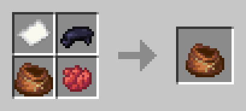

# Playing Card Models
Are you tired of using maps or banners to create playing cards in Minecraft? Or perhaps you're hesitant to install a mod solely to use cards in-game? Introducing custom playing card models!

This resource pack adds custom model data to the Carved Pumpkin (wearable) and Paper (non-placeable) items, from ids `52000` to `52052`. 

Additionally, this project also comes with a datapack that defines a function `cards:deck` that summons a bundle with one of each card model, and a crafting recipe for the bundle of cards.

## Usage
### Resource Pack
Place `PlayingCards/` in your resource packs folder and select the resource pack in Minecraft to load the models.

### Datapack
Place `PlayingCards_datapack/` in the datapacks folder of a Minecraft world. Run the following function to give yourself a bundle of cards
```
\function cards:deck
```
Alternatively, you may craft the cards with the following recipe:



### Modifications
As with any other texture in-game, the textures for the card back and faces may be modified/upscaled as desired.

# Credits
The model and textures were created using [BlockBench](https://www.blockbench.net/).

This project was inspired by docm77's [S10E26 of Hermitcraft](https://youtu.be/yb9VvNva9Pc?si=GEDGSzc9RdpObUgf), where he introduces his idea for a functional in-game poker system.